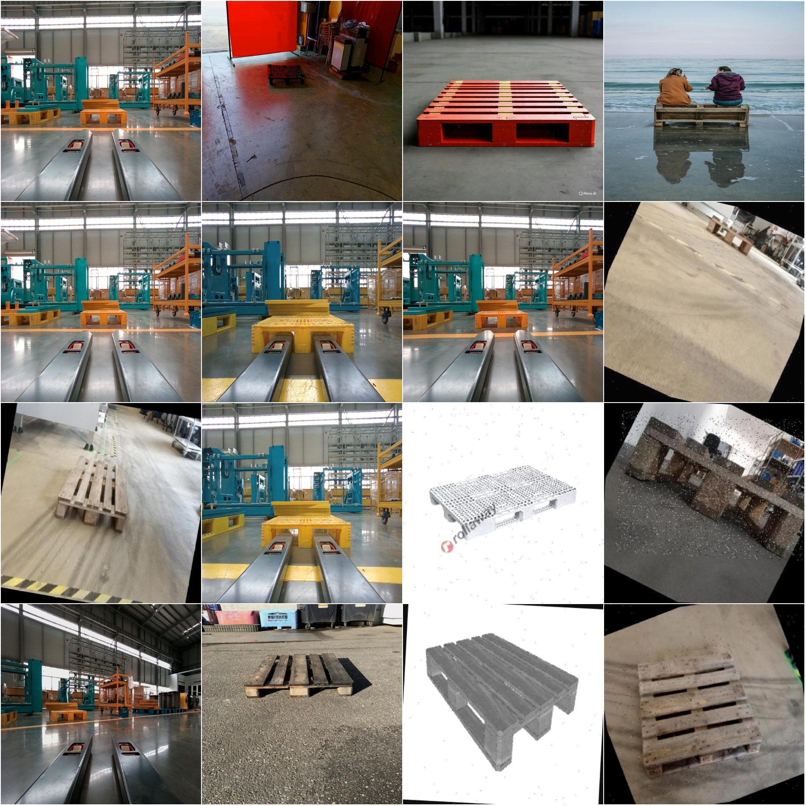
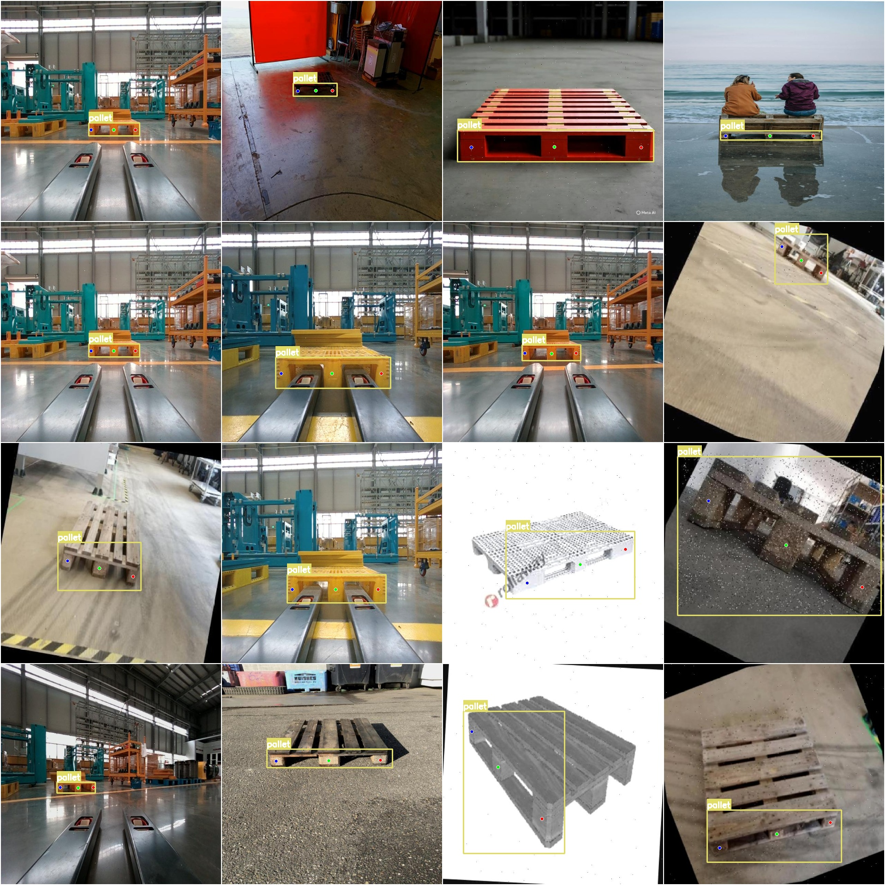

# Pallet Pose Detection Keypoint Dataset in YOLO format: 1943 Images, 1 Category, 3 Keypoints

Please note that approximately 850 images in the dataset are original images, while the remaining are rotationally augmented to generate additional images.

Dataset Format: YOLO keypoint format (Note: This is not a target detection or segmentation YOLO format, but rather contains JPG images along with corresponding YOLO keypoint text files).

Number of Images: 1943 JPG Files
Number of Annotations: 1943 Text Files
Training Set: 1710
Validation Set: 157
Test Set: 76
Number of Annotation Categories: 1
Annotation Category Name: ['pallet']
Number of Keypoints for Each Category: 3
Keypoints per Box:
- Pallet boxes = 3118
- Total boxes = 3118
Image Resolution: 640x640
Special Note: The dataset has been pre-segmented into training, validation, and test sets, and can be directly used for training models such as Yolov5-Pose, Yolov8-Pose, Yolov11-Pose, or Yolov26-Pose.
Special Reminder: The dataset does not guarantee the accuracy of the trained model or weight files.
Image Preview:
Annotation Examples:
Original Images (randomly selected 16):
Annotation drawing results:

## Images

Here is a pay link on Stripe ( https://buy.stripe.com/3cs8yP7sY87d0vu9AB ). Please contact me lonlonago@foxmail.com after funding $89, and I will send you a complete data files , thank you!

